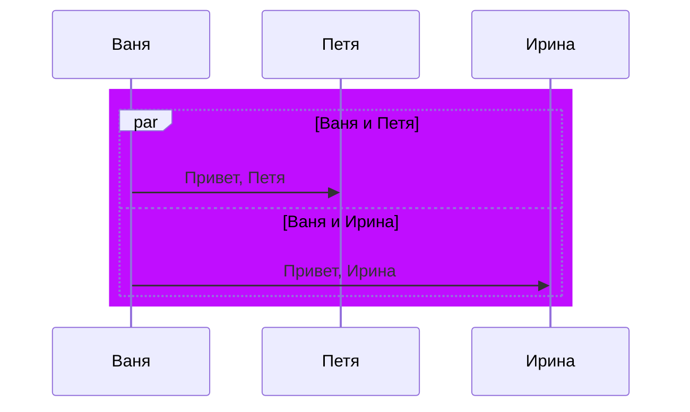

## DeliveryServiceEM

DeliveryServiceEM - модуль по фильтрации и составление списков для доставки грузов до место назначения.

# В репозитории есть  следующее:
- скрипты для разворачивания БД на PostgresSQL
- скрипты для автоматического генерации случайных данных
- составление списков по заданному фильтру на отправку
- логирование
- файл конфигурации

# Для поднятии базы 
> [!IMPORTANT]
> Прежде, необходимо сохранить файл `\Postgrsql\txt-cities-russia.txt` в дерикторию базы. 

> [!NOTE].
> Узнать расположение поможет скрипт `show data_directory;`

Необходим PostgreSQL и выполнение всех скриптов в папке `\Postgrsql`.

